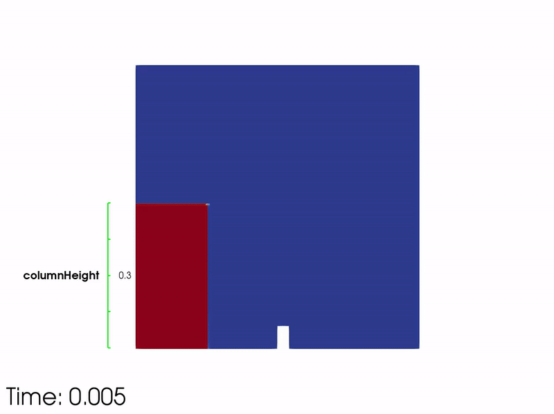
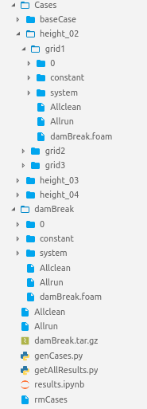
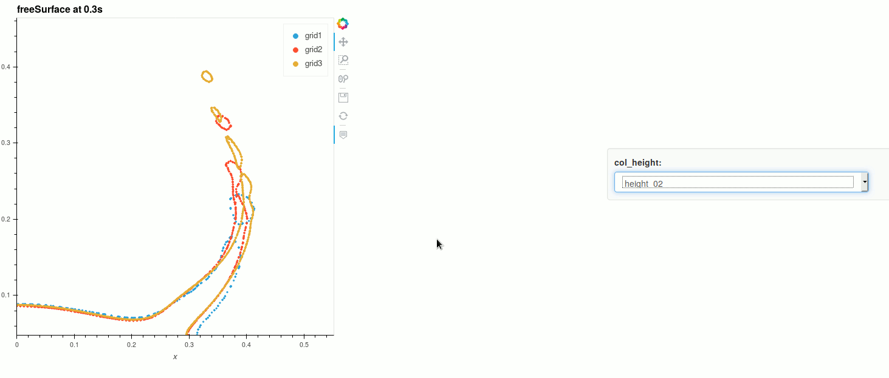

=========================================================
**CaseFOAM** - An OpenFOAM case manipulatior and creator.
=========================================================

.. start-badges

.. image:: https://readthedocs.org/projects/casefoam/badge/?version=latest
:target: https://casefoam.readthedocs.io/en/latest/?badge=latest
:alt: Documentation Status

.. end-badges

.. _intro:

This module is a addition to ``PyFoam`` and can automatically setup OpenFOAM
cases with varying conditions.

.. _getting_started:

Getting started
===============

.. _installing-casefoam:

Installing CaseFOAM
-------------------

In order to use the Python module you need the ``PyFoam`` package.

install the package after cloning the repository with:

.. sourcecode:: bash

   $ pip install .
 
 or via pypi by executing:
 
.. sourcecode:: bash

   $ pip install casefoam

User's Guide
------------

For a full documentation change into `doc` and build the documentation for
example as html.

.. sourcecode:: bash

    $ cd doc/
    $ make html
    $ firefox build/html/index.html

Example
========

CaseFoam offers two main features: the easy generation of parameter studies
and the analysis of these. In the example, we want to change the intial height
of the column and perform a grid study for the damBreak test case:

parameter studies
-----------------

The first step is the generation of the cases. We want to generate three
column heights where each case has three grids with a differnt cell size.

.. sourcecode:: python

    cat genCases.py:

    import casefoam

    baseCase = 'damBreak'
    caseStructure = [['height_02', 'height_03', 'height_04'],
                    ['grid1', 'grid2', 'grid3']
                    ]

    def update_grid(a,b,c,d,e):
        return {
            'system/blockMeshDict': {'#!stringManipulation': {'varA': '%s' %a,
                                                              'varB': '%s' %b,
                                                              'varC': '%s' %c,
                                                              'varD': '%s' %d,
                                                              'varE': '%s' %e
                                                              }
                                    }
        }

    def update_height(height):
        return {
            'system/setFieldsDict': {'#!stringManipulation':
                                    {'var_height': '%s' %height}}
        }

    caseData = {
        'height_02': update_height(0.2),
        'height_03': update_height(0.3),
        'height_04': update_height(0.4),
        'grid1': update_grid(23,8,19,42,4),
        'grid2': update_grid(23*2,8*2,19*2,42*2,4*2),
        'grid3': update_grid(23*3,8*3,19*3,42*3,4*3)
    }

    # generate cases
    casefoam.mkCases(baseCase, caseStructure, caseData, hierarchy='tree',writeDir='Cases')

There a three different options how the cases can be manipulated:

    - replacing a string inside the specified files
    - executing a bash script
    - by specifying a dictionary

for details please see the user manual.

The script is executed by:

.. sourcecode:: python

    python genCases.py

This will the generate the following structure:

The cases can be started by running the newly created Allrun script

.. sourcecode:: python

    ./Allrun

postProcessing
--------------

Three functions are avaiable for the postProcessing:

    - time_series
    - positional_field
    - posField_to_timeSeries

For the damBreak test case we want to plot the freesurface position at a given time.
For that, we use the positional_field function and get a pandas dataframe which we plot with holoviews

.. sourcecode:: python

    import casefoam
    import matplotlib.pyplot as plt
    import pandas as pd
    import holoviews as hv
    hv.extension('bokeh')

    caseStructure = [['height_02', 'height_03', 'height_04'],
                    ['grid1', 'grid2', 'grid3']]
    baseCase = 'Cases'
    surfaceDir = 'freeSurface'
    surface = casefoam.positional_field(surfaceDir,'U_freeSurface.raw',0.3,caseStructure,baseCase)
    surface.columns = ['x','y','z','Ux','Uy','Uz','col_height','res']
    surface_ds = hv.Dataset(surface, [ 'col_height','res'], ['x','y','z','Ux','Uy','Uz'])

holoviews is optimized for the use for the jupyter notebooks. The %%opts arguments are used to modify the layout of the plot.
holoviews renders an interactive plot which can be exported as html:

.. sourcecode:: python

    %%opts Scatter [width=600,height=600,title='freeSurface at 0.3s',tools=['hover']]
    %%opts (muted_alpha=0.0)
    surface_ds.to(hv.Scatter,'x','y').overlay('res')

